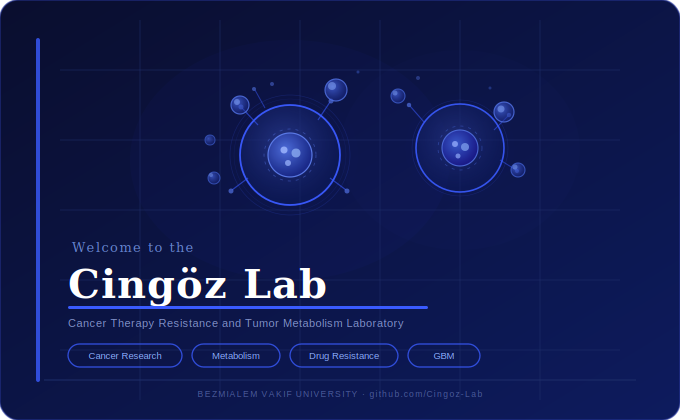

  

 

<h1 align="center">Welcome to Cingöz Lab 🌟</h1>

  <b>Cancer Therapy Resistance & Tumor Metabolism Laboratory</b> 
  Bezmialem Vakif University · Istanbul, Turkey

  
  
  

---

## 🧬 About Us

Our laboratory investigates the mechanisms of **therapy resistance** and **tumor metabolism** in brain cancers, with a primary focus on **Glioblastoma (GBM)** — the most common and aggressive malignant brain tumor with a mean survival of less than 15 months after diagnosis.

Therapy resistance and extreme invasiveness are among the root causes of therapeutic failure in GBM. Our mission is to uncover these mechanisms, advance scientific understanding, and develop open-source computational tools for the research community.

---

## 🔬 Research Focus

| Area | Description |
|------|-------------|
| 🎯 **TRAIL Resistance** | Mechanisms of innate and acquired resistance to TRAIL-induced apoptosis in GBM cells |
| ✂️ **CRISPR Functional Genomics** | Genome-scale screens to identify novel therapeutic vulnerabilities |
| ⚡ **Tumor Metabolism** | Metabolic rewiring in GBM and its role in treatment resistance |
| 💊 **Apoptosis Pathways** | Reactivating dormant apoptotic pathways as a therapeutic strategy |

---

## 🛠️ Languages & Tools

  
  &nbsp;
  
  &nbsp;
  
  &nbsp;
  
  &nbsp;
  
  &nbsp;
  
  &nbsp;
  
  &nbsp;
  
  &nbsp;
  
  &nbsp;
  

---

## 🤝 Collaborations & Opportunities

We warmly welcome collaborations with researchers, clinicians, bioinformaticians, and institutions worldwide. Whether you're interested in joint projects, data sharing, or student exchanges — reach out!

📧 [info@cingozlab.com](mailto:info@cingozlab.com)

---

## 🏛️ Funding & Affiliations

  
  &nbsp;
  
  &nbsp;
  

**Societies:**
- **ICDS** — International Cell Death Society
- **EACR** — European Association for Cancer Research
- **AACR** — American Association for Cancer Research
- **MOKAD** — Molecular Cancer Research Association
- **TBD** — Turkish Biochemistry Society

---

## 🔗 Follow Us

- 🌐 Website: [cingozlab.com](https://cingozlab.com)
- 🐦 Twitter: [@ACingozLab](https://x.com/ACingozLab)
- 📬 Email: [info@cingozlab.com](mailto:info@cingozlab.com)

---

  © 2024 Cingöz Lab · Bezmialem Vakif University · All rights reserved.

